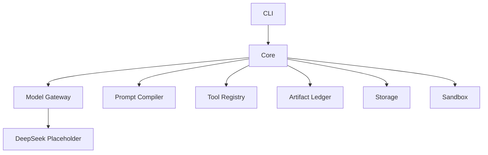

<p align="center">
  
</p>

# DeepSeek_Science

A Rust-first Science Agent Kernel for reproducible, auditable, and low-cost STEM workflows.

<p>
  
  
  
  
</p>

## Overview

DeepSeek_Science is a Rust-first, headless Science Agent Kernel for building
replayable, auditable, cache-aware scientific workflows. Phase 1 is focused on
kernel contracts only: core run records, model gateway types, prompt prefix
caching, tool metadata, artifact provenance, storage traits, sandbox policy, and
a minimal CLI.

This repository is not a UI application. Phase 1 intentionally excludes
TypeScript, Node, Bun, Tauri, Electron, GPUI, egui, Slint, web server
frameworks, real database implementations, and real provider API calls.

DeepSeek is the first intended model family, but the architecture is a Hybrid
Model Gateway. No real DeepSeek API calls are implemented yet. The kernel must
remain domain-neutral: the future `chemistry.kinetics_csv` workflow is only a
vertical validation target, not a core assumption.

## Design Principles

- Rust-only kernel first.
- Headless before UI.
- Tools over hallucination.
- Artifacts over chat logs.
- Provenance by default.
- Cache-aware prompt design.
- Domain packs instead of domain-specific core logic.
- Disk-safe development.

## Current Status

| Area | Status |
| --- | --- |
| Rust workspace initialized | Present |
| Minimal CLI doctor command | Present |
| Provider-neutral model types | Present |
| DeepSeek placeholder pricing/descriptors | Present |
| Prompt Prefix Compiler | Present |
| Tool registry metadata | Present |
| Artifact/provenance types | Present |
| Storage traits/layout | Present |
| Sandbox policy interfaces | Present |
| UI | Not implemented |
| Real API calls | Not implemented |
| Chemistry workflow | Not implemented |

## Workspace

| Crate | Role |
| --- | --- |
| `deepseek-science-core` | Domain-neutral IDs, projects, threads, runs, steps, states, events, and core errors. |
| `deepseek-science-model` | Provider-neutral model gateway requests, responses, routing, capabilities, usage, cache policy, and privacy policy. |
| `deepseek-science-model-deepseek` | DeepSeek descriptors and mock pricing placeholders only. |
| `deepseek-science-prompt` | Prompt Prefix Compiler, stable-prefix hashing, variable-tail separation, and version metadata. |
| `deepseek-science-tools` | Generic tool definitions, schemas, calls, results, risk levels, permissions, and registry metadata. |
| `deepseek-science-common` | Small pure-Rust scientific utilities that do not belong to a domain pack. |
| `deepseek-science-artifacts` | Artifact manifests, references, hashes, review status, and provenance records. |
| `deepseek-science-storage` | Deterministic storage layout helpers and repository traits, without a database engine. |
| `deepseek-science-sandbox` | Deny-by-default sandbox policy and future runner interfaces. |
| `deepseek-science-cli` | Minimal headless CLI entry point and direct terminal output boundary. |

## Architecture



## Quick Start

```sh
cargo check --workspace
cargo test --workspace --lib
cargo run -p deepseek-science-cli -- doctor
```

Crate-specific check and test aliases are defined in `.cargo/config.toml`.

## Phase 1 Boundaries

Phase 1 is kernel-only. It should stay small, compileable, and boring:

- No UI.
- No TypeScript, Node, Bun, npm, Tauri, Electron, GPUI, egui, or Slint.
- No real DeepSeek API calls.
- No API key loading.
- No real database implementation.
- No Python tool execution.
- No full plugin marketplace.
- No chemistry-specific logic in `deepseek-science-core`.

## Disk Safety

Disk safety is a first-class project rule. Cargo build output is configured
outside the source tree:

```text
../.cache/deepseek-science-target
```

Generated run output, artifact output, logs, coverage, profiling output,
temporary files, local agent rules, and environment files should stay out of
version control. Cleanup scripts must be explicit, narrow, and confirmation
based.

## Long-Term Direction

The first planned validation workflow is `chemistry.kinetics_csv`, a small
headless vertical slice for proving ingestion, analysis steps, artifact
generation, and provenance. It must remain outside the domain-neutral core.

The long-term goal is STEM-wide extensibility across chemistry, physics,
materials science, engineering, mathematics, bioinformatics, and related
scientific domains.
