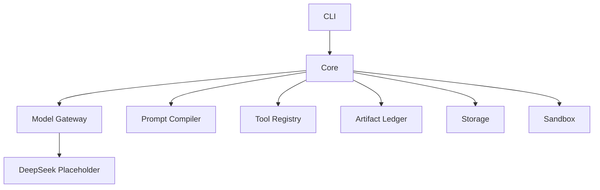

<p align="center">
  
</p>

<h1 align="center">DeepSeek_Science</h1>

<p align="center">
  <strong>A Rust-first Science Agent Kernel for reproducible, auditable, and low-cost STEM workflows.</strong>
</p>

<p align="center">
  
  
  
  
</p>

## Overview

DeepSeek_Science is a Rust-first, headless Science Agent Kernel for building
replayable, auditable, cache-aware scientific workflows. Phase 1 is focused on
kernel contracts only: core run records, model gateway types, prompt prefix
caching, tool metadata, artifact provenance, storage traits, sandbox policy, and
a minimal CLI.

This repository is not a UI application. Phase 1 intentionally excludes
TypeScript, Node, Bun, Tauri, Electron, GPUI, egui, Slint, web server
frameworks, real database implementations, and real provider API calls.

DeepSeek is the first intended model family, but the architecture is a Hybrid
Model Gateway. No real DeepSeek API calls are implemented yet. The kernel must
remain domain-neutral: the future `chemistry.kinetics_csv` workflow is only a
vertical validation target, not a core assumption.

## Design Principles

- Rust-only kernel first.
- Headless before UI.
- Tools over hallucination.
- Artifacts over chat logs.
- Provenance by default.
- Cache-aware prompt design.
- Domain packs instead of domain-specific core logic.
- Disk-safe development.

## Current Status

| Area | Status |
| --- | --- |
| Rust workspace initialized | Present |
| Minimal CLI doctor command | Present |
| Provider-neutral model types | Present |
| DeepSeek placeholder pricing/descriptors | Present |
| Prompt Prefix Compiler | Present |
| Tool registry metadata | Present |
| Artifact/provenance types | Present |
| Storage traits/layout | Present |
| Sandbox policy interfaces | Present |
| UI | Not implemented |
| Real API calls | Not implemented |
| Chemistry workflow | CLI MVP present for `chemistry.kinetics_csv` |

## Workspace

| Crate | Role |
| --- | --- |
| `deepseek-science-core` | Domain-neutral IDs, projects, threads, runs, steps, states, events, and core errors. |
| `deepseek-science-model` | Provider-neutral model gateway requests, responses, routing, capabilities, usage, cache policy, and privacy policy. |
| `deepseek-science-model-deepseek` | DeepSeek descriptors and mock pricing placeholders only. |
| `deepseek-science-prompt` | Prompt Prefix Compiler, stable-prefix hashing, variable-tail separation, and version metadata. |
| `deepseek-science-tools` | Generic tool definitions, schemas, calls, results, risk levels, permissions, and registry metadata. |
| `deepseek-science-common` | Small pure-Rust scientific utilities that do not belong to a domain pack. |
| `deepseek-science-artifacts` | Artifact manifests, references, hashes, review status, and provenance records. |
| `deepseek-science-storage` | Deterministic storage layout helpers and repository traits, without a database engine. |
| `deepseek-science-sandbox` | Deny-by-default sandbox policy and future runner interfaces. |
| `deepseek-science-cli` | Minimal headless CLI entry point and direct terminal output boundary. |

## Architecture



## Quick Start

```sh
cargo check --workspace
cargo test --workspace --lib
cargo run -p deepseek-science-cli -- doctor
```

Crate-specific check and test aliases are defined in `.cargo/config.toml`.

## Current CLI MVP

### Read-only laboratory data inspection

Inspect one explicit laboratory text file without modifying it:

```sh
deepseek-science data inspect --input <path>
```

Inspection is read-only and limited to 16 MiB. It supports UTF-8 with or
without a BOM, plus UTF-16LE and UTF-16BE when the corresponding BOM is
present. Only comma and tab delimiters are inspected. The report describes the
encoding, BOM, delimiter, bounded table evidence, generic shape, and current
kinetics-workflow compatibility.

Structural incompatibility is reported without repairing or rewriting the
input. Inspection does not select chemistry columns, run kinetics analysis,
create project state, or write files.

### Explicit laboratory text conversion

Normalize one eligible inspected table into one new simple CSV file:

```sh
deepseek-science data convert \
  --input <path> \
  --output <path>
```

Conversion is explicit and deliberately narrow. It supports UTF-8 with a BOM,
BOM-marked UTF-16LE/BE, and tab-delimited named finite numeric narrow tables.
Output is deterministic UTF-8 without a BOM, comma-delimited, LF-only, and has
exactly one trailing newline. Exact safe header and numeric cell text is
preserved; numeric values are not reformatted.

Input is limited to 16 MiB and normalized output to 24 MiB. The output parent
must already exist, and an existing target is never overwritten. Input already
compatible with the current UTF-8 comma parser is rejected because it can be
used directly.

Conversion refuses matrices, metadata preambles, unit rows, blank rows, quoted
or multiline fields, ambiguous structure, cells requiring whitespace repair,
and content requiring CSV quoting. It does not infer columns, run kinetics,
call a model, create project state, or provide JSON output.

### Kinetics analysis

The implemented user-facing analysis command is:

```sh
deepseek-science kinetics analyze \
  --input <path> \
  --time-column <column> \
  --concentration-column <column> \
  [--json] \
  [--output <path>]
```

Example CSV input:

```csv
time_s,concentration_mol_l
0,1
1,0.5
2,0.25
3,0.125
```

Current CSV support is intentionally narrow: comma-separated UTF-8 text, one
header row, numeric data rows only, and no quoted or multiline CSV fields. The
caller must provide exact time and concentration column names; the CLI does not
autodetect kinetics columns.

The command reads one user-provided CSV file, parses it into an in-memory
`DataTable`, validates the kinetics input, computes deterministic first-order
and second-order linearized fits, compares them with the MVP finite
`r_squared` heuristic, runs deterministic reviewer checks, and prints a plain
text summary.

The summary includes valid and rejected row counts, first-order and second-order
`k` and `r_squared` values, the model preferred by MVP `r_squared` heuristic,
and review status. This preference is not final scientific model selection.

Text output is the default. Successful text mode writes a human-readable summary
to stdout, while errors write concise human-readable messages to stderr.

Structured JSON output is also available for successful runs:

```sh
deepseek-science kinetics analyze \
  --input crates/deepseek-science-cli/tests/fixtures/kinetics_success.csv \
  --time-column time_s \
  --concentration-column concentration_mol_l \
  --json
```

`--json` changes only the successful output format. Successful JSON mode writes
one JSON object to stdout, errors still write concise human-readable messages to
stderr, and v0.2 does not define a JSON error schema. JSON stdout does not mix
human prose or warnings outside the JSON object.

Top-level JSON fields are:

- `schema_version`
- `command`
- `input`
- `columns`
- `counts`
- `fits`
- `comparison`
- `review`

`schema_version` is `kinetics.analysis.v1`, and `command` is
`kinetics.analyze`.

Minimal JSON shape:

```json
{
  "schema_version": "kinetics.analysis.v1",
  "command": "kinetics.analyze",
  "input": {
    "path": "..."
  },
  "columns": {
    "time": "time_s",
    "concentration": "concentration_mol_l"
  },
  "counts": {
    "valid_points": 4,
    "rejected_rows": 0
  },
  "fits": {
    "first_order": { "...": "..." },
    "second_order": { "...": "..." }
  },
  "comparison": {
    "basis": "finite_r_squared_mvp_heuristic",
    "preferred_model": "first_order",
    "caution": "preferred_by_mvp_r_squared_heuristic_not_final_scientific_model_selection"
  },
  "review": {
    "status": "passed",
    "findings": []
  }
}
```

The preferred model is preferred by the MVP finite `r_squared` heuristic and is
not final scientific model selection.

Successful analysis can also explicitly save the same deterministic JSON:

```sh
deepseek-science kinetics analyze \
  --input crates/deepseek-science-cli/tests/fixtures/kinetics_success.csv \
  --time-column time_s \
  --concentration-column concentration_mol_l \
  --output result.json
```

Without `--output`, the command remains no-write. The parent directory must
already exist, and the output target must not exist because files are never
overwritten. With `--json --output`, stdout and the saved file contain
byte-identical JSON.

### Deterministic kinetics SVG plot

Plotting is a separate explicit command from `kinetics analyze`:

```sh
deepseek-science kinetics plot \
  --input <path> \
  --time-column <column> \
  --concentration-column <column> \
  --output <path.svg>
```

The command reads one regular simple numeric UTF-8 CSV limited to 16 MiB,
uses the exact selected columns and existing deterministic kinetics analysis,
and publishes one standalone deterministic SVG. The chart shows accepted
observations together with the existing first-order and second-order fits; its
MVP heuristic preference is not a confirmed reaction-order determination.

The `.svg` target must be new and its parent directory must already exist.
Existing targets are never overwritten, directories are not created, and no
JSON sidecar or other persistent output is produced. `kinetics analyze` remains
an independent text/JSON command and does not implicitly create a plot.

Current limitations:

- No DeepSeek or other model calls.
- No model-generated explanations.
- No model-based encoding, delimiter, table, or chemistry detection.
- No tool execution.
- Data conversion is limited to the explicit narrow BOM/UTF-16/tab contract.
- No metadata removal, unit-row removal, whitespace repair, or matrix conversion.
- No full CSV dialect support, quoted fields, or multiline fields.
- No semicolon delimiter or locale-dependent number detection.
- No Excel or proprietary binary instrument formats.
- No automatic chemistry interpretation or column selection.
- No batch or recursive data import.
- No JSON error schema.
- No output overwrite support.
- No artifact persistence.
- No storage records or project workspace storage.
- No UI.
- No notebook, Jupyter, R, PubMed, or HPC integrations.

Disk safety: `data inspect` reads exactly one explicit regular file and writes
nothing. For `kinetics analyze`, omitting `--output` also writes no files.
Explicit analysis `--output` may create one bounded sibling temporary file
while atomically publishing one JSON target. These commands create no parent
directories, storage records, logs, caches, artifacts, run records, or project
workspace state. Explicit `data convert --output` likewise uses atomic
create-new publication for one target, never overwrites, and never creates its
parent directory. Explicit `kinetics plot --output` uses the same atomic
create-new publication boundary for one SVG target and creates no JSON sidecar.

## Phase 1 Boundaries

Phase 1 is kernel-only. It should stay small, compileable, and boring:

- No UI.
- No TypeScript, Node, Bun, npm, Tauri, Electron, GPUI, egui, or Slint.
- No real DeepSeek API calls.
- No API key loading.
- No real database implementation.
- No Python tool execution.
- No full plugin marketplace.
- No chemistry-specific logic in `deepseek-science-core`.

## Disk Safety

Disk safety is a first-class project rule. Cargo build output is configured
outside the source tree:

```text
../.cache/deepseek-science-target
```

Generated run output, artifact output, logs, coverage, profiling output,
temporary files, local agent rules, and environment files should stay out of
version control. Cleanup scripts must be explicit, narrow, and confirmation
based.

## Long-Term Direction

The first planned validation workflow is `chemistry.kinetics_csv`, a small
headless vertical slice for proving ingestion, analysis steps, artifact
generation, and provenance. It must remain outside the domain-neutral core.

The long-term goal is STEM-wide extensibility across chemistry, physics,
materials science, engineering, mathematics, bioinformatics, and related
scientific domains.

## Contributing

Please read [CONTRIBUTING.md](CONTRIBUTING.md) before opening issues or pull
requests.

## License

DeepSeek_Science is licensed under the [MIT License](LICENSE).
